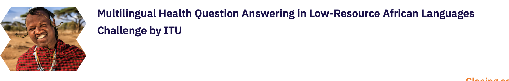
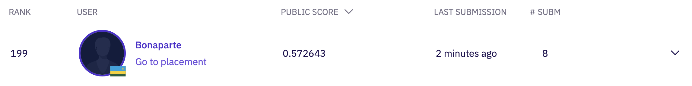
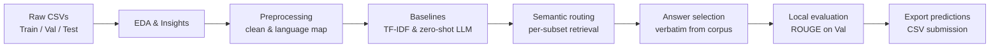

<p align="center">
  
</p>

<h1 align="center">Multilingual Health Q&A</h1>

<p align="center">
  <strong>Retrieval-first semantic routing for low-resource African health question answering</strong>
</p>

<p align="center">
  <a href="https://zindi.africa/competitions/multilingual-health-question-answering-in-low-resource-african-languages-challenge">Zindi Challenge</a>
  ·
  <a href="multilingual_health_qa_notebook.ipynb">Notebook</a>
  ·
  <a href="experiment_log.json">Experiment log</a>
</p>

<p align="center">
  
  
  
  
</p>

---

## Overview

This repository documents an end-to-end solution for the [**Multilingual Health Question Answering in Low-Resource African Languages**](https://zindi.africa/competitions/multilingual-health-question-answering-in-low-resource-african-languages-challenge) challenge hosted on Zindi in partnership with ITU and the HASH consortium.

Given a health-related question in one of five African languages, the system returns an expert answer **in the same language**. The final approach is a **retrieval-first, per-subset semantic routing pipeline** that indexes curated question–answer pairs and returns verbatim in-corpus answers ranked by dense multilingual similarity, with sparse TF-IDF blending for low-resource subsets.

Development followed a structured workflow:

**EDA → baselines → semantic routing → seven targeted ablations**

All runs are logged in [`experiment_log.json`](experiment_log.json) and scored locally with **ROUGE-1** and **ROUGE-L** F1 on `Val.csv`.

---

## Results

| Metric | Value |
|---|---|
| **Public score** | 0.572643 |
| **Rank** | 199 |
| **Submissions** | 8 |
| **Primary approach** | Semantic routing with expanded train+validation index (E16) |

<p align="center">
  
</p>

| Evaluation mode | Index | Best ROUGE-1 F1 | Experiment |
|---|---|---|---|
| Honest validation (no leakage) | `Train.csv` only | **0.474** | E18 |
| Leaderboard proxy | `Train + Val` | **0.493** | E16b |

---

## Approach



### Design principles

1. **Evidence-driven modelling** — architectural choices trace to quantitative EDA findings.
2. **Baseline anchoring** — sparse and generative baselines define the performance envelope before optimisation.
3. **Retrieval-first architecture** — expert answers in the training corpus overlap strongly with references; returning in-corpus text outperforms unconstrained generation.
4. **Subset-aware routing** — language–country subsets receive independent indexes and hybrid blend weights.
5. **Reproducible experimentation** — fixed random seed, structured logging, and documented evaluation protocols.
6. **Transparent evaluation** — honest and proxy metrics are reported separately to avoid conflating generalisation with submission strategy.

### Core model

| Component | Choice |
|---|---|
| Dense encoder | `sentence-transformers/paraphrase-multilingual-mpnet-base-v2` |
| Sparse leg | Word TF-IDF (char n-grams for weak subsets) |
| Routing | Per-subset `LANGUAGE_STRATEGY` with tuned hybrid weights |
| Answer selection | Top-1 verbatim retrieval from knowledge bank |

---

## Languages

| Language | Script | Example subset codes |
|---|---|---|
| English | Latin | `Eng_Uga`, `Eng_Gha`, `Eng_Eth`, `Eng_Ken` |
| Akan | Latin (extended) | `Aka_Gha` |
| Luganda | Latin | `Lug_Uga` |
| Swahili | Latin | `Swa_Ken` |
| Amharic | Ge'ez (Ethiopic) | `Amh_Eth` |

The `subset` column encodes both language and country (e.g. `Eng_Uga` = English, Uganda).

---

## Experiment summary

| ID | Name | Category | ROUGE-1 F1 | ROUGE-L F1 |
|---|---|---|---|---|
| E01 | TF-IDF global retrieval | baseline | 0.427 | 0.374 |
| E07 | Zero-shot `google/mt5-small` | baseline | 0.015 | 0.014 |
| E16 | Semantic routing (baseline) | semantic | **0.471** | 0.419 |
| E17 | Hybrid weight tuning | semantic | 0.474 | 0.421 |
| E18 | Char-TF-IDF hybrid | semantic | **0.474** | 0.421 |
| E19 | E5-base encoder | semantic | 0.474 | 0.422 |
| E20 | Score normalization | semantic | 0.472 | 0.420 |
| E21 | Conflict-aware retrieval | semantic | 0.473 | 0.421 |
| E22 | Similarity threshold fallback | semantic | 0.474 | 0.421 |
| E23 | Cross-subset fallback | semantic | 0.474 | 0.421 |

Full details, rationales, and timestamps are in [`experiment_log.json`](experiment_log.json).

---

## Project structure

```
.
├── multilingual_health_qa_notebook.ipynb   # Full end-to-end notebook (Google Colab)
├── experiment_log.json                     # Structured experiment tracker
├── requirements.txt                          # Python dependencies
├── SampleSubmission.csv                      # Zindi submission format reference
├── submission_*.csv                          # Ablation submission files
├── figures/                                  # EDA and evaluation plots
│   ├── baseline_comparison.png
│   ├── baseline_comparison_trend.png
│   ├── eda_answer_length_cdf.png
│   ├── eda_answer_length_kde.png
│   ├── eda_script_pie.png
│   └── eval_tfidf_by_subset.png
└── images/
    ├── zindi-competetion.png                 # Challenge banner
    └── zindi-ranking.png                     # Leaderboard screenshot
```

---

## Quick start

### 1. Clone and install

```bash
git clone <your-repo-url>
cd Summative-Zindi-Challenge
python -m venv .venv && source .venv/bin/activate
pip install -r requirements.txt
```

### 2. Download data

Obtain `Train.csv`, `Val.csv`, and `Test.csv` from the [Zindi competition page](https://zindi.africa/competitions/multilingual-health-question-answering-in-low-resource-african-languages-challenge) (not included in this repo).

### 3. Run the notebook

Open [`multilingual_health_qa_notebook.ipynb`](multilingual_health_qa_notebook.ipynb) in [Google Colab](https://colab.research.google.com/):

1. Upload the three CSV files to `My Drive/zindi-challenge/`.
2. Set **Runtime → Change runtime type → T4 GPU** when running the LLM baseline (Section 11).
3. Sections 13–14 (semantic routing) run on CPU; a GPU speeds up embedding encoding.

### 4. Reproduce submissions

The notebook exports submission CSVs to the working directory. The primary Zindi submission uses the semantic routing pipeline (E16) with an expanded train+validation knowledge bank.

---

## Evaluation protocol

Two evaluation modes are reported throughout the notebook:

| Mode | Index | Purpose |
|---|---|---|
| **Honest (E16a)** | `Train.csv` only | Measures generalisation without validation leakage |
| **Leaderboard proxy (E16b)** | `Train + Val` | Approximates the expanded knowledge bank permitted at submission time; `exclude_id` prevents self-match on validation queries |

---

## Key findings from EDA

| Finding | Implication | Design response |
|---|---|---|
| English ≈ 60% of data; Amharic ≈ 6% | Weak subsets need targeted blending | Per-subset semantic / TF-IDF routing weights |
| Answers are long (~76 words avg) | Generation is hard; retrieval fits better | Verbatim in-corpus answer selection |
| Duplicate questions with conflicting answers | Wrong retrieval from near-duplicates | Question-level dedup + exact-match lookup (E21) |
| Ge'ez and extended Latin scripts | Word tokenisation is weak | Char n-gram TF-IDF for `Aka_Gha`, `Amh_Eth`, `Eng_Gha` (E18) |

---

## Acknowledgments

- [Zindi](https://zindi.africa/) and [ITU](https://www.itu.int/) for hosting the challenge
- The HASH consortium for curating the AfriHealth-QA dataset
- Open-source models: [paraphrase-multilingual-mpnet-base-v2](https://huggingface.co/sentence-transformers/paraphrase-multilingual-mpnet-base-v2), [google/mt5-small](https://huggingface.co/google/mt5-small)
